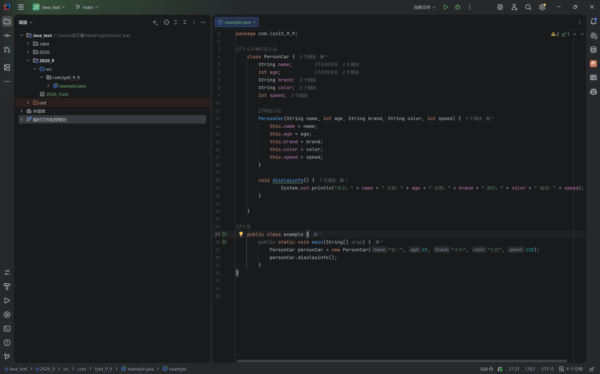

```java
package com.lyxit_9_9;  
  
//个人车辆信息记录  
    class PersonCar {  
        String name;        //实例变量  
        int age;            //实例变量  
        String brand;  
        String color;  
        int speed;  
  
        //构造方法  
        PersonCar(String name, int age, String brand, String color, int speed) {  
            this.name = name;  
            this.age = age;  
            this.brand = brand;  
            this.color = color;  
            this.speed = speed;  
        }  
  
        void disolayinfo() {  
                System.out.println(
                "姓名：" + name + " 年龄：" + age + " 品牌：" +  
                 brand + " 颜色：" + color + " 速度：" + speed);  
                
        }  
  
    }  
  
//主类  
    public class example {  
        public static void main(String[] args) {  
            PersonCar personCar = new PersonCar("张三", 25, "丰田", "红色", 120);  
            personCar.disolayinfo();  
        }  
}
```


代码图片实例

